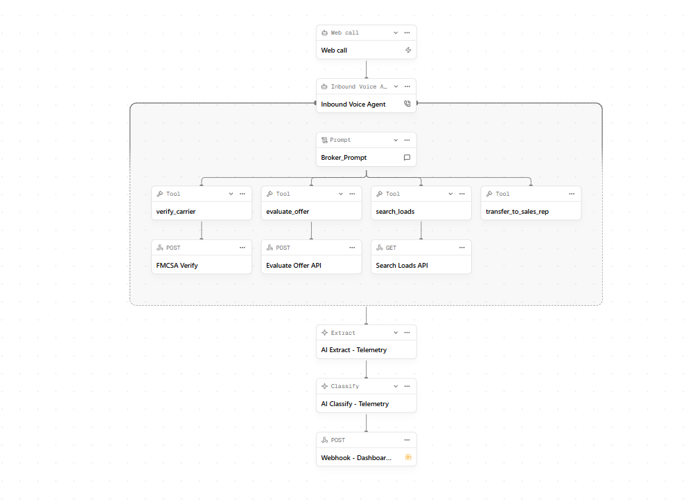
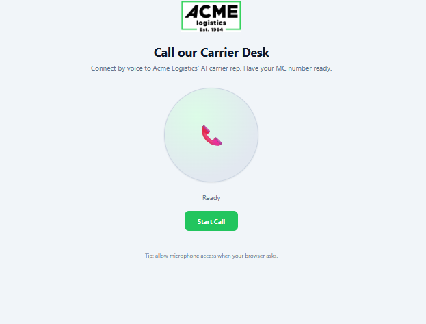
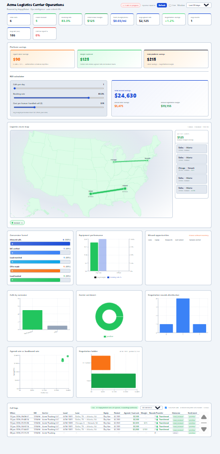

# HappyRobot FDE Technical Challenge Submission

## Acme Logistics — Inbound Carrier Sales

A full implementation of the HappyRobot FDE technical challenge: an AI
voice agent that takes inbound calls from freight carriers, verifies
them with FMCSA, matches them to a load, negotiates a price (max 3
rounds), and hands off to a human sales rep on agreement. Plus a custom
ops dashboard fed by post-call telemetry and HappyRobot platform sync.

---

## Challenge fit

This repository is structured as a submission for the **FDE Technical Challenge: Inbound Carrier Sales**.

- **Objective 1: Inbound use case** — implemented with a HappyRobot inbound voice agent, FMCSA verification, load search, bounded negotiation, mocked transfer, post-call extraction, outcome classification, and sentiment tracking.
- **Objective 2: Metrics** — implemented with a custom React + FastAPI dashboard; no HappyRobot analytics UI is used as the reporting surface.
- **Objective 3: Deployment and infrastructure** — implemented with Docker, local `docker compose`, and live deployment on Fly.io.

### Submission artifacts

- **Build description for the broker** — `deliverables/acme-logistics-build-description.md`
- **Architecture deep dive** — `docs/architecture.md`
- **Workflow setup / reproducibility notes** — `docs/workflow-setup.md`
- **Live deployed dashboard and API** — links below
- **Code repository** — this repository

---

## Live demo (Fly.io)

| App | URL |
|-----|-----|
| **Dashboard** | https://acme-carrier-app-hugog.fly.dev/dashboard |
| **Web call** | https://acme-carrier-app-hugog.fly.dev/call |
| **API** | https://acme-carrier-api-hugog.fly.dev |
| **Swagger** | https://acme-carrier-api-hugog.fly.dev/docs |

---

## What to test in 3 minutes

If you're reviewing this challenge quickly, this is the fastest path:

1. Open the **web call** and start a session as a carrier.
2. Use demo MC `123456` if FMCSA is unavailable or you want a deterministic happy path.
3. Ask for a lane like `Dallas -> Atlanta` or `Chicago -> Newark` with `Dry Van`.
4. Counter on price a couple of times and watch the backend enforce the floor rate and the 3-round cap.
5. Open the **dashboard**, hit refresh, and confirm the call appears in KPIs, route map, funnel, and recent call logs.

What this proves: real tool use during the call, deterministic pricing guardrails in the backend, and post-call telemetry flowing into ops visibility.

### Why this is a strong fit for the brief

- It uses the **web call trigger**, as requested, instead of buying a phone number.
- It keeps **pricing logic and compliance-sensitive checks server-side**, not inside the prompt.
- It shows **customer thinking**, not just workflow wiring: a rep-ready dashboard, telemetry repair path, security basics, and a credible production evolution path.

---

## Screenshots

### HappyRobot workflow

Web Call trigger → Inbound Voice Agent with four webhook tools → post-call Extract / Classify → dashboard webhook.



### Web call

Browser-based LiveKit session — carriers reach the AI rep without a phone trunk.



### Ops dashboard

KPIs, platform savings breakdown, route map, conversion funnel, and live call logs fed by post-call telemetry and HappyRobot sync.



---

## Architecture

```
┌─────────────┐    LiveKit WebRTC   ┌──────────────────┐
│   Browser   │◄──────────────────► │  HappyRobot      │
│ (Web Call)  │                     │  Voice Agent     │
└──────┬──────┘                     │  (your workflow) │
       │  POST /api/voice/token     └─────────┬────────┘
       │                                      │   webhook tools:
       │                                      │   - verify_carrier
       ▼                                      │   - search_loads
┌─────────────────────────────────────────────┴─────────────┐
│                        Backend (FastAPI)                  │
│                                                           │
│  /api/voice/token              ← mints LiveKit tokens     │
│  /api/fmcsa/verify             ← proxies FMCSA            │
│  /api/loads/search             ← load board (8 loads)     │
│  /api/loads/evaluate-offer     ← deterministic negotiation│
│  /api/webhooks/call-completed  ← post-call sink           │
│  /api/metrics/*                ← dashboard KPIs & charts  │
│  /api/metrics/sync-happyrobot  ← backfill from HR runs    │
└────────────────────────────┬──────────────────────────────┘
                             │  SQLite call_records
                             ▼
                    ┌────────────────┐
                    │  React UI      │
                    │  /call         │
                    │  /dashboard    │
                    └────────────────┘
```

### Call telemetry (two paths)

1. **Post-call webhook** — HappyRobot POSTs AI Extract + Classify + transcript to `/api/webhooks/call-completed` when the workflow is wired correctly.
2. **Platform sync** — On dashboard refresh, the backend calls the HappyRobot Runs API and **reconstructs** call records from tool outputs (FMCSA Verify, Search Loads, Evaluate Offer) and the voice-agent transcript when the webhook payload is incomplete.

---

## System design

This section documents the architectural choices behind the POC — what each layer owns, where state lives, and how the system behaves under failure or scale.

### Layer responsibilities

| Layer | Owns | Does *not* own |
|-------|------|----------------|
| **Frontend** (React) | Web-call UI, dashboard reads, LiveKit client | Business rules, API secrets, pricing decisions |
| **HappyRobot** | Voice I/O, STT/TTS, LLM orchestration, tool calling, post-call AI Extract/Classify | FMCSA keys, load board, negotiation policy, persistence |
| **Backend** (FastAPI) | Auth, FMCSA proxy, load search, negotiation engine, telemetry sink, metrics | Natural-language conversation |

The LLM is a **thin orchestrator**: it detects intent, extracts parameters from speech, and reads tool results aloud. Every decision that affects money, compliance, or auditability runs in Python.

### Trust boundaries

```
┌──────────────────────────────────────────────────────────────┐
│  Untrusted / semi-trusted                                    │
│  Browser (web call, dashboard)  ·  HappyRobot (tool caller)  │
└────────────────────────────┬─────────────────────────────────┘
                             │  HTTPS + X-API-Key (tools/metrics)
                             ▼
┌──────────────────────────────────────────────────────────────┐
│  Trusted zone — Backend                                      │
│  Secrets · negotiation policy · floor rates · call_records   │
└────────────────────────────┬─────────────────────────────────┘
                             │
              FMCSA API · HappyRobot API · SQLite/Postgres
```

- **Secrets never reach the client** — `FMCSA_WEB_KEY` and `HAPPYROBOT_API_KEY` stay server-side; the browser sends `X-API-Key` (from build env) for all `/api/*` routes including voice tokens.
- **Floor rates never reach the agent** — `min_acceptable_rate` is stripped from every `/api/loads/*` response.

### Architectural decisions

#### 1. Server-side negotiation (not in the prompt)

LLMs are unreliable with spoken numbers and arithmetic. The agent calls `POST /api/loads/evaluate-offer` on every carrier offer; the backend returns `accept | counter | reject` plus the counter price. The 3-round cap and per-load floor are enforced in code — testable, version-controlled, and auditable.

Changing negotiation policy is a **code deploy**, not a prompt edit.

#### 2. FMCSA as a backend proxy (not a direct HappyRobot webhook)

| Concern | Direct FMCSA call from workflow | Proxy via backend |
|---------|--------------------------------|-------------------|
| API key exposure | In HappyRobot config | Server-only |
| Response shape | Nested FMCSA JSON | Normalized `{ eligible, carrier_name, reason }` |
| Resilience | Single point of failure | Timeout (5s), demo-carrier fallback, future Redis cache |
| Extensibility | Hard to add allowlist | Middleware hook before load search |

#### 3. Dual telemetry path (webhook + platform sync)

Post-call data is **eventually consistent**. The primary path is the workflow webhook; when Extract/Classify mis-fire (empty transcript input, unresolved `@` placeholders), the dashboard triggers `POST /api/metrics/sync-happyrobot`, which reconstructs call records from HappyRobot run tool outputs. This makes the ops view resilient to workflow misconfiguration without blocking the live call path.

#### 4. Defensive input normalization

Tool parameters originate from **speech → STT → LLM**, so the API tolerates dirty input: MC digits stripped of prefixes, city names without state suffixes, equipment typos (`drive van` → `Dry Van`), and progressive search relaxation when a strict lane match returns nothing.

### Call flow (happy path)

| Step | Actor | Action |
|------|-------|--------|
| 1 | Browser | `POST /api/voice/token` → LiveKit credentials |
| 2 | Browser ↔ HappyRobot | WebRTC audio session |
| 3 | Agent | Greet → collect & confirm MC → `verify_carrier` |
| 4 | Backend | FMCSA lookup → `{ eligible, carrier_name }` |
| 5 | Agent | Collect lane + equipment → `search_loads` |
| 6 | Agent | Pitch top match → carrier proposes rate |
| 7 | Agent | `evaluate_offer(round_number=1..3)` per offer |
| 8 | Agent | On accept → `transfer_to_sales_rep` (mock in POC) |
| 9 | HappyRobot | AI Extract → AI Classify → webhook → `call_records` |
| 10 | Dashboard | Reads `/api/metrics/*`; optional platform sync backfill |

Real-time conversation (steps 2–8) is decoupled from persistence (steps 9–10): a slow webhook never blocks the caller.

### Failure modes & mitigations

| Failure | Impact | Mitigation in POC | Production next step |
|---------|--------|-------------------|------------------------|
| FMCSA timeout / 403 | Carrier can't be verified | 5s timeout; demo MC `123456`; agent retries once then offers callback | Redis cache (MC → result, TTL 24h); circuit breaker |
| HappyRobot tool timeout | Tool call fails mid-call | Prompt: retry once, don't restart from Step 1 | Alert on tool p99; shorten FMCSA path via cache |
| Webhook 422 / empty extract | Dashboard missing data | Payload coercion; always HTTP 200; platform sync backfill | Idempotent upsert on `run_id`; monitor extract quality |
| LLM hallucinates a rate | Wrong quote to carrier | Agent instructed to trust `evaluate_offer` only; load fields come from tool output | Server-side validation of agreed_rate vs last tool response |
| SQLite write contention | Lost call record under load | Acceptable for demo volume | `DATABASE_URL` → Postgres (already supported) |
| Token endpoint abuse | Unauthorized calls minted | CORS + workflow ID allowlist on HappyRobot side | Session cookie, rate limit per IP |

### Data model & single source of truth

| Datum | Source of truth | Notes |
|-------|-----------------|-------|
| Load board | `loads` table (seed JSON on boot) | `min_acceptable_rate` internal only |
| Call history | `call_records` table | Written by webhook; repaired by platform sync |
| Outcome label | AI Classify (post-call) | Normalized in `normalize.py`; overridden if `agreed_rate > 0` |
| Negotiation decision | `evaluate-offer` endpoint | Authoritative during the call |
| Transcript | HappyRobot run | Stored in `call_records`; not duplicated as audio |

Webhooks use **`run_id`** as the natural idempotency key when upserting from platform sync, preventing duplicate rows on re-sync.

### Scaling path (POC → production)

| Dimension | POC | Production |
|-----------|-----|------------|
| Database | SQLite on Fly volume | Postgres + read replica for metrics |
| Load board | `seed_loads.json` | TMS adapter behind `/api/loads/search` (same API contract) |
| Post-call writes | Synchronous webhook handler | Queue (SQS/RabbitMQ) + worker for `call_records` |
| FMCSA | Live API per call | Redis cache + stale-while-revalidate |
| Auth | Build-time `VITE_API_KEY` | SSO proxy in front of dashboard; session-gated token endpoint |
| Voice channel | Web Call (LiveKit) | PSTN trunk + Direct Transfer node (same 4 tools) |
| Observability | Fly logs + Swagger | Structured JSON logs, OpenTelemetry on webhooks, business KPI alerts |
| Multi-tenant | Single broker | `tenant_id` on loads + call_records; row-level security |

Estimated load for context: **10k calls/day ≈ 0.1 req/s average**, with post-call webhook bursts after peak hours — a single Postgres instance and async write queue handle this comfortably before needing horizontal scale.

### CQRS-lite read/write split

- **Commands** (mutate state): `evaluate-offer`, `call-completed` webhook, platform sync
- **Queries** (read-only): `/api/loads/search`, `/api/metrics/*`

The dashboard is read-only; it never writes call data. All writes funnel through the webhook sink or sync job, keeping analytics consistent with the conversation record.

---

## Dashboard

The ops dashboard (`/dashboard`) includes:

- **KPIs** — total calls, loads booked, booking rate, total broker margin, yield per mile, avg agreed rate, extra margin %, avg negotiation rounds, avg call duration, FMCSA reject %
- **Platform savings** — a dedicated ROI panel that breaks out agent labor savings, margin captured, and total platform impact for the demo
- **Route map** — booked lanes on a US map with per-lane broker margin
- **Operational views** — conversion funnel, equipment performance, missed opportunities, calls by outcome, carrier sentiment, and negotiation rounds distribution
- **Pricing analysis** — agreed-vs-loadboard scatter plus per-call negotiation ladder
- **Call logs** — live rows from the API; merges all HappyRobot production runs with webhook records
- **Call detail modal** — transcript + classification reasoning per row
- **Auto-refresh** — every 30s (syncs HappyRobot runs, then reloads metrics)

Demo data fills charts only when there are **no** live calls in the API.

---

## Repository layout

Monorepo: **backend** (API) · **frontend** (SPA) · **caddy** (TLS) · **docs** · **deliverables**.

```
.
├── backend/
│   ├── Dockerfile              Python 3.12 + Uvicorn
│   ├── fly.toml
│   └── app/ …
├── frontend/
│   ├── Dockerfile              Node build → nginx
│   ├── fly.toml
│   └── src/ …
├── caddy/                      TLS reverse proxy configs
├── docker-compose.yml          backend + frontend (+ optional caddy)
├── docs/
├── deliverables/
```

**Full tree, layering rules, naming conventions, and production evolution:** see Repository layout above.

---

## Quick start

```bash
git clone <this-repo>
cd carrier-sales-agent
cp backend/.env.example backend/.env
cp frontend/.env.example frontend/.env
# fill in: API_KEY (same in both), FMCSA_WEB_KEY,
#          HAPPYROBOT_API_KEY, HAPPYROBOT_WORKFLOW_ID
docker compose up --build
```

| Page | URL |
|------|-----|
| Backend Swagger | http://localhost:8000/docs |
| Web call | http://localhost:5173/call |
| Dashboard | http://localhost:5173/dashboard |

The DB is auto-seeded with 8 sample loads (`backend/app/db/seed_loads.json`)
on first start. Wipe with `docker compose down -v`.

---

## Docker & deployment (Objective 3)

The solution is **fully containerized**. Two application images plus optional TLS proxy — orchestrated with **Docker Compose** locally and deployed to **Fly.io** in production.

### Container images

| Service | Image | Dockerfile | Port |
|---------|-------|------------|------|
| **Backend** | `python:3.12-slim` → FastAPI + Uvicorn | [`backend/Dockerfile`](backend/Dockerfile) | 8000 |
| **Frontend** | Multi-stage: `node:20` build → `nginx:alpine` serve | [`frontend/Dockerfile`](frontend/Dockerfile) | 80 (mapped to 5173) |
| **Caddy** *(optional)* | `caddy:2-alpine` — HTTPS reverse proxy | [`caddy/Caddyfile`](caddy/Caddyfile) / [`Caddyfile.local`](caddy/Caddyfile.local) | 443 / 8443–8444 |

The frontend image bakes `VITE_API_BASE_URL` and `VITE_API_KEY` at **build time** via Docker build args (see `docker-compose.yml`).

### Docker Compose (local)

[`docker-compose.yml`](docker-compose.yml) defines:

- **`backend`** — API with healthcheck on `/healthz`, SQLite persisted in volume `backend_data:/app/data`
- **`frontend`** — static SPA behind nginx, depends on backend
- **`caddy`** *(profile `https`)* — local TLS with self-signed certs (`docker compose --profile https up --build`)

```bash
# HTTP (default)
docker compose up --build

# HTTPS locally (self-signed)
docker compose --profile https up --build
```

### Production deploy

| Target | How | HTTPS |
|--------|-----|-------|
| **Fly.io** *(live demo)* | `fly deploy` per app — see [`backend/fly.toml`](backend/fly.toml), [`frontend/fly.toml`](frontend/fly.toml) | Automatic (Let's Encrypt) |
| **VPS + domain** | Uncomment Caddy in compose + edit `caddy/Caddyfile` | Let's Encrypt via Caddy |

Full recipes: [`docs/deployment.md`](docs/deployment.md) · Security / TLS: [`docs/security.md`](docs/security.md)

### Reproducibility

```bash
git clone <this-repo>
cd carrier-sales-agent
cp backend/.env.example backend/.env
cp frontend/.env.example frontend/.env
# fill secrets → then:
docker compose up --build
```

No host Python or Node required — everything runs inside containers.

### Environment variables

| Variable | Where | Purpose |
|----------|-------|---------|
| `API_KEY` | backend + frontend (`VITE_API_KEY`) | Auth header for API calls |
| `FMCSA_WEB_KEY` | backend | FMCSA carrier verification |
| `HAPPYROBOT_API_KEY` | backend | Voice tokens + platform run sync |
| `HAPPYROBOT_WORKFLOW_ID` | backend | Workflow ID for tokens & runs |
| `HAPPYROBOT_BASE_URL` | backend | Default: `https://platform.happyrobot.ai/api/v2` |
| `VITE_API_BASE_URL` | frontend | Backend URL (build-time) |
| `CORS_ORIGINS` | backend | Comma-separated allowed origins |

---

## HappyRobot post-call webhook

Configure a **Webhook** node as a child of the **Inbound Voice Agent** (post-call).
Point it at:

```
POST https://<your-api-host>/api/webhooks/call-completed
Header: X-API-Key: <API_KEY>
```

### Critical: wire transcript into Extract / Classify

On **AI Extract - Telemetry** and **AI Classify - Telemetry**, set the **Input** to:

```
inbound_voice_agent.transcript
```

If these nodes receive an empty `@transcript`, extract returns `null` / `"Not specified"` and the webhook stores bad data even with a correct body.

### Recommended webhook body (HappyRobot node-reference syntax)

```json
{
  "run_id": "current.run_id",
  "mc_number": "ai_extract_telemetry.response.mc_number",
  "carrier_name": "ai_extract_telemetry.response.carrier_name",
  "carrier_eligible": ai_extract_telemetry.response.carrier_eligible,
  "load_id": "ai_extract_telemetry.response.load_id",
  "loadboard_rate": ai_extract_telemetry.response.loadboard_rate,
  "agreed_rate": ai_extract_telemetry.response.agreed_rate,
  "counter_offers": ai_extract_telemetry.response.counter_offers,
  "origin": "ai_extract_telemetry.response.origin",
  "destination": "ai_extract_telemetry.response.destination",
  "equipment_type": "ai_extract_telemetry.response.equipment_type",
  "outcome": "ai_classify_telemetry.response.classification",
  "sentiment": "inbound_voice_agent.real_time_sentiment_classifier",
  "classification_reasoning": "ai_classify_telemetry.response.reasoning",
  "duration_seconds": 0,
  "call_duration_seconds": inbound_voice_agent.duration,
  "transcript": "inbound_voice_agent.transcript"
}
```

After editing the workflow, **Publish** and verify the webhook node output shows no `422` error.

The backend coerces messy payloads (`null`, `"Not specified"`, unresolved `@` placeholders, transcript arrays) and **always returns HTTP 200** so HappyRobot does not mark the node as failed.

### Alternate `@` syntax (legacy docs style)

If your workflow uses `@extract` / `@classify` references, use this body — **change `@classify.outcome` to `@classify.classification`**:

```json
{
  "run_id": "@run_id",
  "mc_number": "@extract.mc_number",
  "carrier_name": "@extract.carrier_name",
  "carrier_eligible": @extract.carrier_eligible,
  "load_id": "@extract.load_id",
  "loadboard_rate": @extract.loadboard_rate,
  "agreed_rate": @extract.agreed_rate,
  "counter_offers": @extract.counter_offers,
  "origin": "@extract.origin",
  "destination": "@extract.destination",
  "equipment_type": "@extract.equipment_type",
  "outcome": "@classify.classification",
  "sentiment": "@sentiment_classifier.result",
  "call_duration_seconds": @duration,
  "transcript": "@transcript"
}
```

> If extract/classify nodes still receive an empty `@transcript`, fields will be blank — wire their **Input** to the voice agent transcript (see above). The dashboard sync (`POST /api/metrics/sync-happyrobot`) backfills full data from tool outputs after each refresh.

---

## API reference (summary)

| Method | Path | Auth | Description |
|--------|------|------|-------------|
| `GET` | `/healthz` | — | Liveness |
| `POST` | `/api/voice/token` | ✓ | LiveKit token for web call |
| `POST` | `/api/fmcsa/verify` | ✓ | Verify carrier MC |
| `GET` | `/api/loads/search` | ✓ | Search load board |
| `POST` | `/api/loads/evaluate-offer` | ✓ | Negotiation policy |
| `POST` | `/api/webhooks/call-completed` | ✓ | Post-call data sink |
| `GET` | `/api/metrics/summary` | ✓ | Dashboard KPIs |
| `GET` | `/api/metrics/recent-calls` | ✓ | Call logs (merged with HR runs) |
| `GET` | `/api/metrics/margin-evolution` | ✓ | Cumulative margin series |
| `POST` | `/api/metrics/sync-happyrobot` | ✓ | Backfill/repair from platform |

---

## Security

See [`docs/security.md`](docs/security.md) for full setup (HTTPS local + production, smoke tests).

- **`X-API-Key` on all `/api/*` routes** — enforced by global middleware + router dependencies. Public paths: `/healthz`, `/docs`, `/openapi.json`, `/redoc` only.
- **HTTPS** — Fly.io / Let's Encrypt in production; local self-signed via `docker compose --profile https` (Caddy internal CA).
- FMCSA web key never leaves the backend.
- HappyRobot API key never leaves the backend.
- The internal `min_acceptable_rate` field is **stripped** from every load response.
- Negotiation policy and the 3-round cap are enforced **server-side**, not in the prompt.

## What's deliberately not in the POC

- Real TMS integration (loads come from JSON, not from a TMS).
- Internal carrier allowlist on top of FMCSA.
- Actual phone transfer (web-call constraint — mocked per the brief).
- Auth on the dashboard (a build-time API key in the bundle; behind SSO
  in production).
