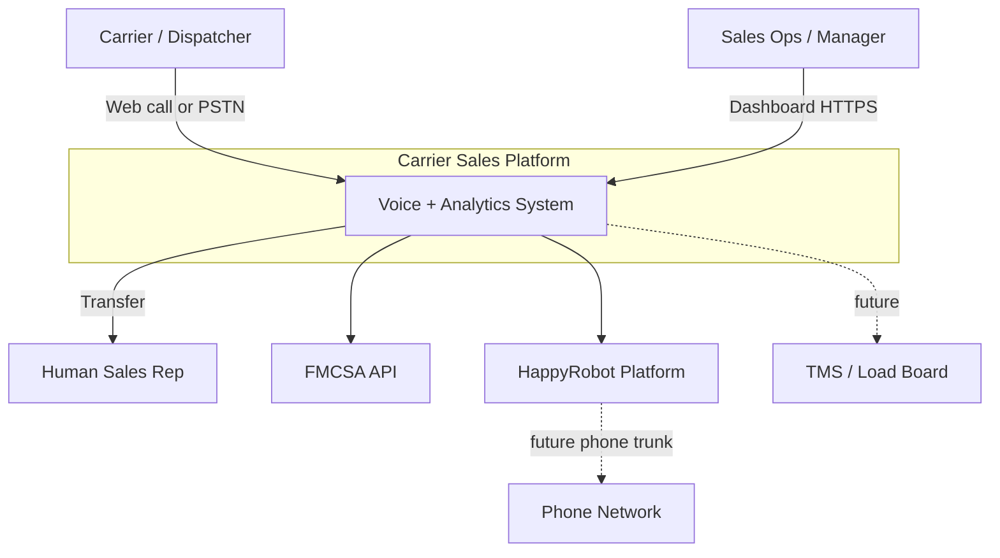
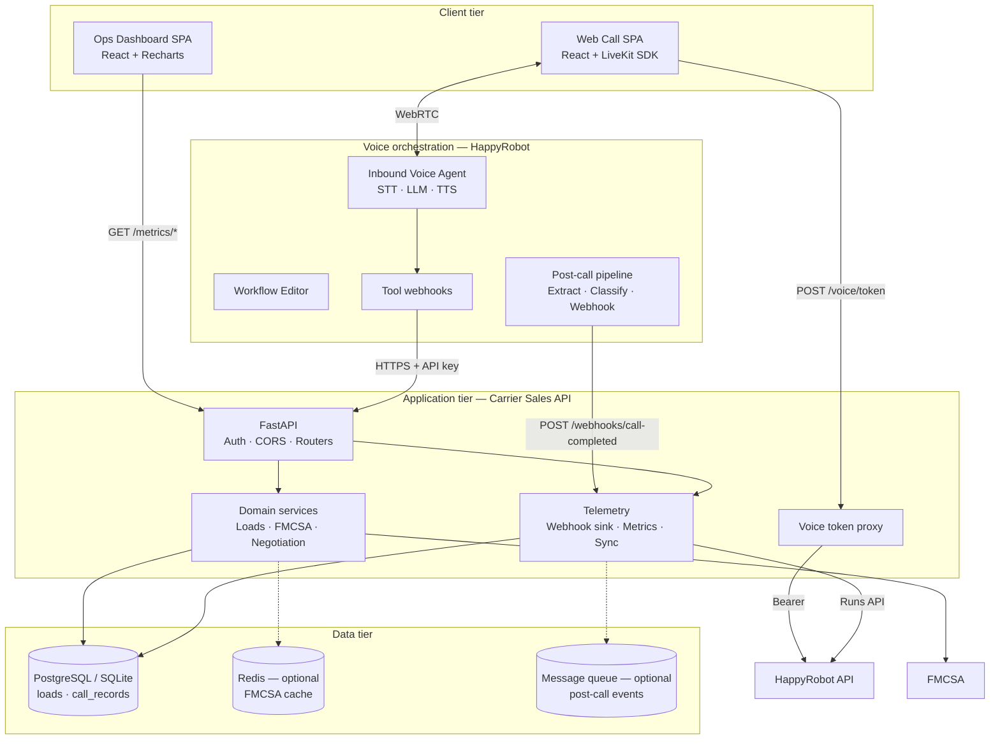
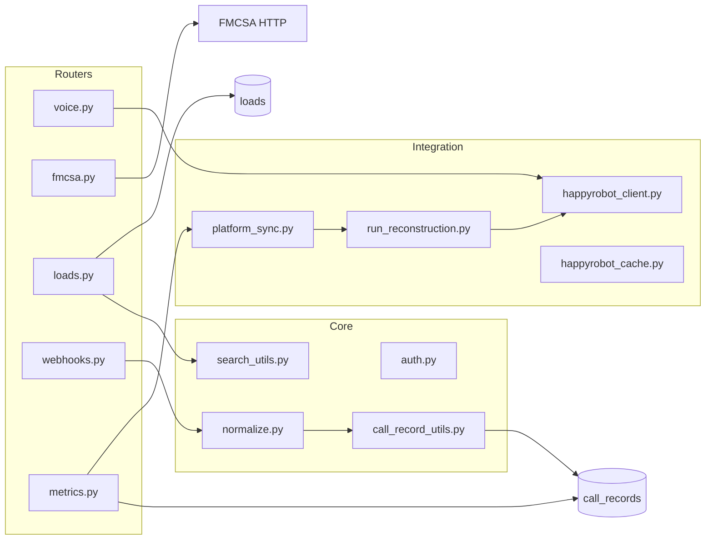
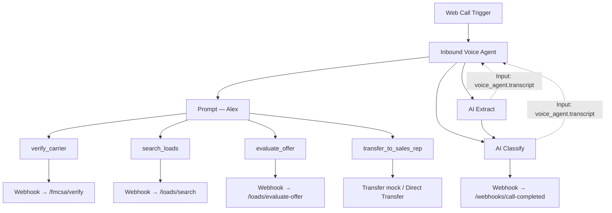
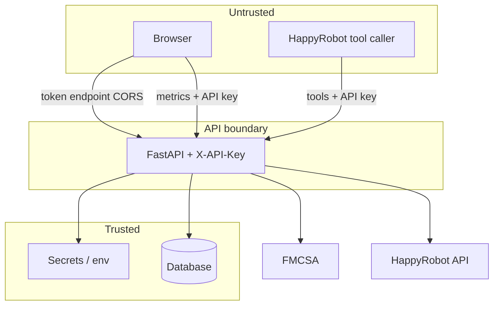
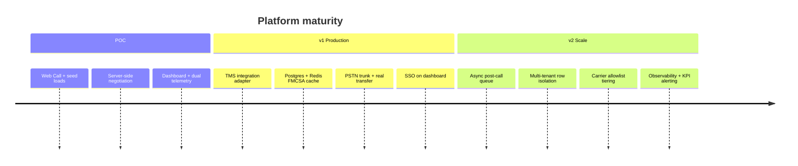

# Architecture — Inbound Carrier Sales Platform

**Version:** 1.0 · **Status:** POC (production-ready path documented)  
**Scope:** AI voice agent for freight carrier inbound sales + ops analytics dashboard

This document describes the target architecture for systems like the Acme Logistics POC: an AI voice front door, a domain API, external compliance and voice platforms, and an operator dashboard.

---

## 1. Problem & quality attributes

### Business problem

Freight brokers receive high-volume inbound calls from carriers seeking loads. Reps spend repetitive time on FMCSA verification, lane matching, rate quoting, and bounded negotiation before a human closes the BOL.

### Solution

An AI voice agent handles the first ~80% of the call; humans take over only on agreement. Structured telemetry feeds an ops dashboard.

### Quality attributes (prioritized)

| Priority | Attribute | POC | Production target |
|----------|-----------|-----|-------------------|
| 1 | **Correctness** | Server-side negotiation & FMCSA gate | Auditable policy engine, idempotent writes |
| 2 | **Security** | API key, secrets server-side | SSO, mTLS to TMS, PII retention policy |
| 3 | **Availability** | Single-region Fly.io | Multi-AZ, circuit breakers on FMCSA |
| 4 | **Observability** | Logs + dashboard | Traces on webhooks, business KPI alerts |
| 5 | **Scalability** | SQLite, sync on refresh | Postgres, async post-call queue |
| 6 | **Latency (voice)** | Tool p99 < 5s | FMCSA cache, regional API |

---

## 2. Context diagram (C4 Level 1)



**External actors**

| Actor | Interaction |
|-------|-------------|
| Carrier | Inbound voice — seeks load, negotiates rate |
| Ops team | Reads KPIs, transcripts, funnel metrics |
| Human rep | Receives transfer with context (MC, load, rate) |
| FMCSA | Carrier authority verification |
| HappyRobot | Voice I/O, LLM orchestration, recording, post-call AI |
| TMS | Source of truth for loads (POC: seeded JSON) |

---

## 3. Container diagram (C4 Level 2)



### Container responsibilities

| Container | Owns | Must not own |
|-----------|------|--------------|
| **Web Call SPA** | LiveKit session UX, mic controls | Business rules, secrets |
| **Dashboard SPA** | KPI visualization, call drill-down | Writes to call history |
| **HappyRobot workflow** | Conversation, tool calling, recording | Pricing policy, FMCSA keys |
| **Carrier Sales API** | Auth, domain logic, persistence, metrics | Real-time audio |
| **Database** | Loads, call records, audit payloads | Conversation state mid-call |

---

## 4. Component diagram — Backend API



| Module | Responsibility |
|--------|----------------|
| `loads.py` | Load search, `LoadOut` DTO (floor stripped), negotiation policy |
| `fmcsa.py` | MC normalization, FMCSA proxy, demo-carrier fallback |
| `voice.py` | LiveKit token minting via HappyRobot API |
| `webhooks.py` | Post-call sink, payload coercion, upsert by `run_id` |
| `metrics.py` | KPI aggregation, recent calls, margin series |
| `platform_sync.py` | Merge platform runs with DB, backfill sparse rows |
| `run_reconstruction.py` | Rebuild call payload from tool outputs + transcript |

---

## 5. HappyRobot workflow architecture



**Critical wiring:** AI Extract and AI Classify **Input** must reference `inbound_voice_agent.transcript` (not unresolved `@transcript`).

---

## 6. Data flows

### 6.1 Real-time call path (synchronous tools)

```
Carrier speech
  → HappyRobot STT
  → LLM decides tool
  → HTTP webhook to API (X-API-Key)
  → Domain logic + DB read
  → JSON response
  → LLM speaks result (TTS)
```

**Latency budget:** FMCSA 5s timeout; other tools < 1s typical.

### 6.2 Post-call telemetry path (async)

```
Call ends
  → AI Extract (structured fields from transcript)
  → AI Classify (outcome label)
  → Webhook POST call-completed
  → normalize + upsert call_records
  → Dashboard reads /metrics/*
```

**Consistency model:** eventual (seconds). Dashboard refresh may trigger platform sync backfill.

### 6.3 Dual-path telemetry (resilience)

| Path | Trigger | When used |
|------|---------|-----------|
| **Primary** | Workflow webhook after call | Extract/Classify wired correctly |
| **Secondary** | `POST /metrics/sync-happyrobot` | Sparse webhook, empty transcript, repair |

Reconstruction reads HappyRobot Runs API node outputs (FMCSA, Search, Evaluate, Voice Agent transcript) and infers outcome when Classify failed.

---

## 7. Data model

### 7.1 `loads` (read-heavy, TMS-backed in prod)

```
load_id               PK
origin, destination   indexed
equipment_type        indexed
loadboard_rate        visible to agent
min_acceptable_rate   INTERNAL — never in LoadOut
pickup/delivery, miles, weight, notes, ...
```

### 7.2 `call_records` (append + upsert by run_id)

```
run_id                idempotency key (HappyRobot)
mc_number, carrier_name, carrier_eligible
load_id, loadboard_rate, agreed_rate, counter_offers[]
origin, destination, equipment_type
outcome, sentiment, classification_reasoning
duration_seconds, transcript, raw_payload (JSON audit)
created_at
```

### 7.3 Data lineage

| Field | Authoritative during call | Authoritative post-call |
|-------|---------------------------|-------------------------|
| Eligibility | `evaluate-offer` N/A — FMCSA tool | FMCSA + Extract |
| Posted rate | `search_loads` response | Extract or Search node output |
| Agreed rate | Last `evaluate_offer` accept | Extract (validated vs tools) |
| Outcome | — | AI Classify → normalized; fallback: reconstruction |
| Floor rate | DB only | Never stored on call_record |

---

## 8. Security architecture



| Control | Implementation |
|---------|----------------|
| Tool auth | `X-API-Key` on all protected routes |
| Secret isolation | FMCSA key, HappyRobot key server-only |
| Data hiding | `min_acceptable_rate` stripped from agent-facing DTOs |
| Token endpoint | Requires `X-API-Key` (SPA sends `VITE_API_KEY`) | Prod: session + rate limit |
| Transport | HTTPS (Fly.io / Caddy + Let's Encrypt) |
| PII | Transcripts in DB; retention/redaction policy in prod |
| Webhook reliability | Always HTTP 200 to HappyRobot; errors logged server-side |

---

## 9. Deployment topology

### POC (current)

```
┌──────────────── Fly.io region ────────────────┐
│  acme-carrier-api  →  FastAPI + SQLite volume │
│  acme-carrier-app  →  nginx + static React    │
└───────────────────────────────────────────────┘
         │                              │
         └──────── HTTPS ───────────────┘
HappyRobot SaaS (voice + workflow)
```

### Production target

```
                    ┌─────────────┐
                    │  Cloudflare │
                    │  / WAF      │
                    └──────┬──────┘
                           │
         ┌─────────────────┼─────────────────┐
         ▼                 ▼                 ▼
   ┌───────────┐    ┌────────────┐    ┌────────────┐
   │ Dashboard │    │ Web Call   │    │ API (×N)   │
   │ CDN       │    │ CDN        │    │ autoscaled │
   └───────────┘    └────────────┘    └─────┬──────┘
                                              │
                    ┌─────────────────────────┼──────────────┐
                    ▼                         ▼              ▼
              PostgreSQL                  Redis          SQS/RabbitMQ
              (+ read replica)            (FMCSA)        (post-call)
                    │
                    └── TMS adapter (loads sync)
```

---

## 10. Architectural decisions (ADR summary)

| ID | Decision | Rationale | Trade-off |
|----|----------|-----------|-----------|
| ADR-01 | Negotiation in API, not LLM | Numeric reliability, auditability | Extra round-trip per offer |
| ADR-02 | FMCSA proxy vs direct tool | Normalized response, key safety | Added latency hop |
| ADR-03 | Web Call vs PSTN for POC | Challenge constraint | Transfer mocked |
| ADR-04 | Dual telemetry (webhook + sync) | Resilient to workflow misconfig | Complexity, duplicate merge logic |
| ADR-05 | SQLite → Postgres path | Fast POC; one env var to migrate | Not HA in POC |
| ADR-06 | Thin LLM, thick domain API | Clear trust boundary | Prompt can't fix bad API |
| ADR-07 | Webhook always 200 | HappyRobot marks node success | Silent failures need logging/alerts |
| ADR-08 | Seed JSON load board | No TMS in scope | Not market-realistic rates |

### Server-side negotiation {#server-side-negotiation}

LLMs are unreliable with spoken numbers. The agent calls `POST /api/loads/evaluate-offer` on every carrier offer; the backend returns `accept | counter | reject` plus the counter price. The 3-round cap and per-load floor are enforced in code — testable and auditable. Policy changes are a **code deploy**, not a prompt edit.

### FMCSA backend proxy {#fmcsa-proxy}

HappyRobot tools call `/api/fmcsa/verify` instead of FMCSA directly. The API key stays server-side; responses are normalized to `{ eligible, carrier_name, reason }`. A 5s timeout and demo MC `123456` fallback keep demos reliable when FMCSA is slow or returns 403.

### Dual telemetry path {#dual-telemetry}

Post-call data is **eventually consistent**. Primary path: workflow webhook after AI Extract/Classify. Secondary: `POST /api/metrics/sync-happyrobot` reconstructs records from HappyRobot Runs API tool outputs when the webhook payload is sparse or empty.

### Defensive input normalization {#defensive-normalization}

Tool parameters originate from speech → STT → LLM. The API tolerates dirty input: MC digits stripped of prefixes, city names without state suffixes, equipment typos (`drive van` → `Dry Van`), and progressive search relaxation when a strict lane match returns nothing.

### run_id idempotency {#run-id-idempotency}

HappyRobot `run_id` is the natural idempotency key when upserting `call_records` from platform sync, preventing duplicate rows on re-sync.

---

## 11. Failure modes & mitigations

| Failure | User impact | Mitigation |
|---------|-------------|------------|
| FMCSA timeout | Can't verify MC | 5s timeout, retry in prompt, demo MC, cache |
| Tool 5xx | Agent apologizes, retries | Prompt retry once; alert on error rate |
| Empty transcript in Extract | Bad dashboard row | Wire `voice_agent.transcript`; platform sync |
| LLM hallucinated rate | Wrong quote | Agent must use tool output only; server validates |
| SQLite lock | Lost write | Postgres + queue in prod |
| Token abuse | Unauthorized calls minted | `X-API-Key` on `/api/voice/token`; rate limit in prod |

---

## 12. Evolution roadmap



---

## 13. Interface catalog

| Method | Path | Consumer | Purpose |
|--------|------|----------|---------|
| POST | `/api/voice/token` | Web Call SPA | LiveKit credentials |
| POST | `/api/fmcsa/verify` | HappyRobot tool | Carrier eligibility |
| GET | `/api/loads/search` | HappyRobot tool | Load board query |
| POST | `/api/loads/evaluate-offer` | HappyRobot tool | Negotiation decision |
| POST | `/api/webhooks/call-completed` | HappyRobot post-call | Persist call telemetry |
| GET | `/api/metrics/*` | Dashboard SPA | KPIs & charts |
| POST | `/api/metrics/sync-happyrobot` | Dashboard refresh | Backfill from Runs API |
| GET | `/healthz` | Load balancer | Liveness |

---

## 14. Layer responsibilities & trust boundaries

| Layer | Owns | Does *not* own |
|-------|------|----------------|
| **Frontend** (React) | Web-call UI, dashboard reads, LiveKit client | Business rules, API secrets, pricing decisions |
| **HappyRobot** | Voice I/O, STT/TTS, LLM orchestration, tool calling, post-call AI | FMCSA keys, load board, negotiation policy, persistence |
| **Backend** (FastAPI) | Auth, FMCSA proxy, load search, negotiation engine, telemetry sink, metrics | Natural-language conversation |

Secrets and floor rates never reach the client or the LLM. The LLM is a **thin orchestrator**; every decision that affects money, compliance, or auditability runs in Python.

## 15. Scaling path (POC → production)

| Dimension | POC | Production |
|-----------|-----|------------|
| Database | SQLite on Fly volume | Postgres + read replica for metrics |
| Load board | `seed_loads.json` | TMS adapter behind `/api/loads/search` (same contract) |
| Post-call writes | Synchronous webhook handler | Queue (SQS/RabbitMQ) + worker |
| FMCSA | Live API per call | Redis cache + stale-while-revalidate |
| Auth | Build-time `VITE_API_KEY` | SSO proxy; session-gated token endpoint |
| Voice channel | Web Call (LiveKit) | PSTN trunk + Direct Transfer node |
| Observability | Fly logs + Swagger | Structured JSON logs, OpenTelemetry, KPI alerts |

Estimated load: **10k calls/day ≈ 0.1 req/s average** — a single Postgres instance and async write queue handle this before horizontal scale.

## 16. CQRS-lite read/write split

- **Commands** (mutate state): `evaluate-offer`, `call-completed` webhook, platform sync
- **Queries** (read-only): `/api/loads/search`, `/api/metrics/*`

The dashboard is read-only; all writes funnel through the webhook sink or sync job.

## 17. Repository layout

Monorepo: **backend** (API) · **frontend** (SPA) · **caddy** (TLS) · **docs** · **deliverables** · **scripts**.

```
.
├── backend/
│   ├── Dockerfile              Python 3.12 + Uvicorn
│   ├── fly.toml
│   └── app/
│       ├── routers/            voice, fmcsa, loads, webhooks, metrics
│       ├── services/           platform_sync, run_reconstruction
│       ├── db/                 models, seed_loads.json
│       └── utils/              normalize, call_records, search
├── frontend/
│   ├── Dockerfile              Node build → nginx
│   ├── fly.toml
│   └── src/
│       ├── pages/              Dashboard, WebCall
│       ├── components/dashboard/
│       ├── hooks/              useDashboardData, useLiveMode
│       └── lib/dashboard/      analytics, mockData, format
├── caddy/                      TLS reverse proxy (local + production)
├── docker-compose.yml
├── docs/                       architecture, deployment, runbook, workflow-setup
├── deliverables/               broker-facing narrative
└── scripts/                    smoke.sh
```

**Layering:** routers → services/utils → DB. No business logic in React beyond presentation and client-side ROI projection. HappyRobot owns conversation; backend owns domain truth.

## 18. Related documents

| Document | Content |
|----------|---------|
| [runbook.md](./runbook.md) | Symptom → diagnosis → fix, smoke checks |
| [workflow-setup.md](./workflow-setup.md) | HappyRobot node configuration |
| [deployment.md](./deployment.md) | Local, Fly.io, Caddy deploy |
| [voice-agent-prompt.md](./voice-agent-prompt.md) | Agent conversation policy |
| [security.md](./security.md) | HTTPS + API key |
| [../deliverables/acme-logistics-build-description.md](../deliverables/acme-logistics-build-description.md) | Customer-facing narrative |

---

*This architecture separates **conversation** (HappyRobot), **domain truth** (API + DB), and **analytics** (metrics layer). Production hardening focuses on TMS integration, async telemetry, and observability without changing the tool contracts the voice agent depends on.*
